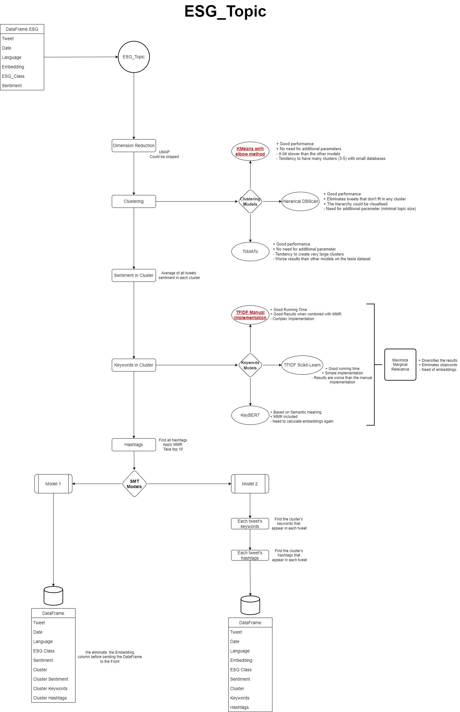

- [Introduction](#introduction)
- [Project Overview](#project-overview)
- [Diagrams](#diagrams)
  - [SMT Model 1 Diagram](#smt-model-1-diagram)
  - [SMT Model 2 Diagram](#smt-model-2-diagram)
  - [Update_DB Diagram](#update_db-diagram)
  - [ESG_Topic Diagram](#esg_topic-diagram)
- [Model 1: The DataScientist Model](#model-1-the-datascientist-model)
  - [Refresh](#refresh)
    - [Update_DB](#update_db)
      - [Input](#input)
      - [Scraping](#scraping)
      - [Preprocess](#preprocess)
      - [Calculate Embeddings](#calculate-embeddings)
      - [E, S, G or Not](#e-s-g-or-not)
      - [Sentiment Analysis](#sentiment-analysis)
      - [Output](#output)
    - [Save the data](#save-the-data)
  - [Visualise](#visualise)
    - [Input](#input-1)
    - [ESG_Topic](#esg_topic)
      - [Input](#input-2)
      - [PreProcess Tweets](#preprocess-tweets)
      - [Dimension Reduction](#dimension-reduction)
      - [Clustering](#clustering)
      - [Sentiment in Cluster](#sentiment-in-cluster)
      - [Keywords in Cluster](#keywords-in-cluster)
      - [Hashtags in Cluster](#hashtags-in-cluster)
      - [Output](#output-1)
    - [Send to Front](#send-to-front)
- [Model 2: The client's model](#model-2-the-clients-model)
  - [Refresh](#refresh-1)
    - [Update_DB](#update_db-1)
    - [Save DataFrame Not ESG](#save-dataframe-not-esg)
    - [Combine DF ESG to DB ESG](#combine-df-esg-to-db-esg)
    - [ESG_Topic](#esg_topic-1)
      - [Input:](#input-3)
      - [Additional Steps:](#additional-steps)
      - [Output](#output-2)
    - [Save the new DB](#save-the-new-db)
  - [Visualise](#visualise-1)
    - [Input](#input-4)
    - [Truncate DataBase](#truncate-database)
    - [Calculate average sentiment per cluster](#calculate-average-sentiment-per-cluster)
    - [Find keywords per cluster](#find-keywords-per-cluster)
    - [Find hashtags per cluster](#find-hashtags-per-cluster)
    - [Drop irrelevant columns](#drop-irrelevant-columns)
    - [Send to Front](#send-to-front-1)
- [Model 1 vs Model 2](#model-1-vs-model-2)
- [Launching SMT](#launching-smt)
- [Changing Parameters](#changing-parameters)
  - [Update_DB](#update_db-2)
    - [Size of weekly Scraping](#size-of-weekly-scraping)
    - [Scaping mode](#scaping-mode)
    - [Embedder model](#embedder-model)
    - [ESG Filter model](#esg-filter-model)
    - [Sentiment model](#sentiment-model)
  - [ESG Topic](#esg-topic)
    - [Clustering Model](#clustering-model)
    - [Keywords extraction model](#keywords-extraction-model)
    - [Skip UMAP](#skip-umap)
    - [New Dimension](#new-dimension)
    - [HDBScan minimal topic size](#hdbscan-minimal-topic-size)
    - [Number of extracted keywords & hashtags](#number-of-extracted-keywords--hashtags)
    - [MMR diversity](#mmr-diversity)
- [Further Improvements & Ideas](#further-improvements--ideas)
  - [Scraping:](#scraping-1)
  - [Preprocessing:](#preprocessing)
  - [ESG Filter](#esg-filter)
  - [Clustering](#clustering-1)
  - [Keywords extraction](#keywords-extraction)
- [Useful readings, flask apps, resources](#useful-readings-flask-apps-resources)
  - [Readings](#readings)
  - [Flask App](#flask-app)
  - [Resources](#resources)

--------

Made by: HusseinRR \
Original date: 31/08/2022 \
Last update: 02/09/2022

--------
# Introduction


Fellow Datascientist!\
 As you're reading this section you're making your very first steps into the quest of Twitter Surfing with SurfMetrics. Be well aware of the journey that awaits you beyond the lines of this markdown,  for the content of this file (along with the code that is :)) is the culmination of a great adventure that i pulled through. \
In particular this file will serve as your guide and weapon against the dark forces of programmer's block and undesirable bugs. \
The code itself is fortified with blocks of Info and Comments so don't hesitate to return to it and make it your ally too. \
In addition to that four maps (or diagrams as they say in the programmers realm) were burried in this same folder. They will help clear your sight and show you the pathes and choices i made along my way. Remember to consult them whenever you feel the multitude of possibilities crawling on you.\
Now without any further ado, i present to you the two models of "Surf Mes Tweets".

--------

# Project Overview

The stucture that was concieved for the SMT (Surf Mes Tweets) project is as follows.\
Suppose a company would like to know it's ESG-reputation on twitter. What we do is scrap the tweets that are related to the company in the ESG topics.\
We measure the sentiment of each tweet, then calculate the average sentiment of the tweets, thus determining the ESG score for the company on twitter.\
\
When a new client subscribes for our product, we start by creating a twitter database for him. This database contains all the tweets we scrapped for him during his subscription period along with further post-processing data that we'll dive into later.\
When he logs in he can manually refresh this database, thus collecting new data online and making the results up-to-date. That's something he'll have to do each certain period of time (depending on the company's size and its activity online) in order to have real-time results.\
Once a database is in our hands, the client can "visualise" his tweets in a nice structured way along with the sentiment score associated with those tweets.\
Now that's really as simple as i could put it for the project description. Brace yourself for now we're going to take a look at the scripts that are the foundation blocks of Twitter Surfing.\

# Diagrams

This section contains the four diagrams that are essential to understand the long process of SMT.
In fact the structure of the two next sections is based on those diagrams so it would be very useful to put them next to you while reading this documentation. You can also find the drawio original files in the "diagrams" folder if you wish to modify them.

In short we have 2 SMT models. Each of those models uses 2 main scripts: __Update_DB__ and __ESG_Topic__. 

So in total we have four diagrams:
- SMT Model 1
- SMT Model 2
- Update_DB
- ESG_Topic

## SMT Model 1 Diagram


## SMT Model 2 Diagram


## Update_DB Diagram


## ESG_Topic Diagram



# Model 1: The DataScientist Model
The first thing you should know is that the code was originally concieved for this model. Where does it get its name from? Well this model is more rigourous and mahematically approriate for an enlighted DataScientist than for a client.
So how does it work? Turn to the diagram SMT_model_1. And let's take it from the top.
The client signs in. We get the name of his company. 
Now the client is presented with two choices:
- Refresh
- Visualise

## Refresh
Let's start with the refresh option. What it does is basically update the database that is already collected for the client. 
To do so it starts by calling the Update_DB script which is one the main blocks of this project.
### Update_DB
Turn your page to the update_db diagram in order to see the whole process that this magnificient script accomplishes.
#### Input
We start by providing a name and a language for the this class. The name will be the company's name, and for the langugage, since most of our clients in the beginning will be French or English enterprises we'll be doing the Update_DB process twice in english and french.
#### Scraping
Once that info is provided the script will start by scraping tweets. This could be done using either tweepy library for a weekly scraping, or twitter api in order to do a full archive search in a certain time interval.

| Full Archive Search | Week Search | 
| ----------- | ----------- |
| Access to Full Archive between two dates | Access to last week's tweets| 
| 50 requests/month  | Unlimited Requests | 
| 100 tweets/ request  | 500 tweets/request | 
| 5000 tweets/ month  | 2M tweets/month |


My advice is to use the weekly search if we're examining a medium-large company with good activity rate on twitter. Otherwise a full archive search could bring us most of the tweets about smaller companies.

#### Preprocess
In order to get rid of undesirable nuisance in our tweets we get rid of urls, the # sign, the mentions, and the 'RT' string that corresponds to "Retweet".

#### Calculate Embeddings
The Embeddings are the vector representation of sentences. In this task we find the embeddings of the preprocessed text.
Three models were considered:
- SBERT
- ESG-BERT
- xlm-RoBERTa-base

<table>
  <tbody>
    <tr>
      <th>Model</th>
      <th>Advantages</th>
      <th>Disadavantages</th>
    </tr>
    <tr>
      <td>SBERT</td>
      <td>
        <ul>
          <li>Excellent Benchmark</li> 
          <li>MultiLing</li>
          <li>Efficient running time</li>
        </ul>
      </td>
      <td >Not finetuned for ESG Tasks</td>
    </tr>
    <tr>
      <td>ESG_BERT</td>
      <td >Finetuned for ESG Tasks</td>
      <td>
        <ul>
          <li>English only</li> 
          <li>Slow running time</li>
        </ul>
      </td>
    </tr>
    <tr>
      <td>xlm-RoBERTa-base</td>
      <td>
        <ul>
          <li>MultiLing</li> 
          <li>Good performance</li>
        </ul>
      </td>
      <td>
        <ul>
          <li>Largest Model very slow</li> 
          <li>Not finetuned for ESG tasks</li>
        </ul>
      </td>
    </tr>
  </tbody>
</table>

__Additional Info:__ 
- We extracted the embedder from the ESG-BERT model by replacing the classifier layer in the model by the identity function.
- The dimension of the extracted embeddings is 768.

#### E, S, G or Not
In this task we want to classify the collected into E, S, G or not (none of the above).
Three models were considered for this particular task:
- Supervised (pretrained on a database):
  - FinBERT

- Semi-Supervised (Relying on a dictionnary):
  - Gram-Schmidt model
  - Mean model
  

<table>
  <tbody>
    <tr>
      <th>Model</th>
      <th>Advantages</th>
      <th>Disadavantages</th>
    </tr>
    <tr>
      <td>FinBERT</td>
      <td>
        <ul>
          <li>Pretrained on dataset</li> 
        </ul>
      </td>
      <td >
        <li>English only</li>
        <li>Slow</li>
      </td>
    </tr>
    <tr>
      <td>Mean Model</td>
      <td >
        <li>Efficient running time</li>
      </td>
      <td>
        <ul>
          <li>Need to define threshhold</li> 
          <li>Language depends on dictionnary</li>
          <li>Performance depends on dictionnary</li> 
        </ul>
      </td>
    </tr>
     <tr>
      <td>GS Model</td>
      <td >
        <li>Efficient running time</li>
      </td>
      <td>
        <ul>
          <li>Need to define threshhold</li> 
          <li>Language depends on dictionnary</li>
          <li>Performance depends on dictionnary</li> 
        </ul>
      </td>
    </tr>
  </tbody>
</table>

__FinBERT__
It was simply imported from Hugging-Face
https://huggingface.co/yiyanghkust/finbert-esg

__Mean Model__
A smart and quite simple idea.\
Suppose we have a dictionnary for the Environmental, Social and Gouvernance themes (which we already have btw). We start by calculating the average embedding of each of those dictionnaries thus we obtain three vectors each representing a certain class among E, S or G.
For a certain tweet embedding we measure the cosine similarity with each of those three vectors. The closest vector should be be the closest class to the tweet. 
Yet the tweet could be very far (in cosine similarity) from the three vectors thus we should set a threshhold below which the vector doesn't belong to any class.

In short suppose t is embedding for a certain tweet, and e,s,g are the embeddings for the E, S, G dictionnaries. 
```python
if max({cosine(t,e), cosine(t,s), cosine(t,g)) > threshhold:
  esg_class(t) = argmax({cosine(t,e), cosine(t,s), cosine(t,g)) 
else:
  esg_class(t) = -1 # -1 being the "not" class
```
__Gram-Schimdt Model__
Inspired by the previous model, GS model increases the complexity a notch. Instead of calculating the average vector of a dictionnary, in this model we'll start by calculating the embedding of each word in the dictionnary. 
Now let's take a look at the E dictionnary for example. The vectors that are produced from this dictionnary form a base for the "E vector space". Now for a certain tweet embedding t we calculate the orthogonal projection t_E of t on the E vector space. The same goes for S and G... We find t_S and t_G.
Finally we proceed exactly with the same logic of the previous model while replacing the e, s, g vectors by t_E, t_S, t_G.
```python
if max({cosine(t,t_E), cosine(t,t_S), cosine(t,t_G)) > threshhold:
  esg_class(t) = argmax({cosine(t,t_E), cosine(t,t_S), cosine(t,t_G)) 
else:
  esg_class(t) = -1 # -1 being the "not" class
``` 
__Which model to use__
Even though we don't really have any firm argument to choose one model over the other i think it would be safer in the mean time to use FinBERT. In fact with some basic testing we found that FinBERT could be the most reliable model in the mean time. We could avoid the non-multiling issue by translating the texts using Google Translate library for example. This would increase the time cost however. 
A tool that could help you better decide would be the Flask app esg_filter (look into "Useful readings, flask apps, resources" section)

#### Sentiment Analysis

In this task we extract the sentiment of each tweet.
Two models were considered for this task:
- Bert Base uncased
- RoBERTa Twitter

<table>
  <tbody>
    <tr>
      <th>Model</th>
      <th>Advantages</th>
      <th>Disadavantages</th>
    </tr>
    <tr>
      <td>BERT Base uncased</td>
      <td>
        <ul>
          <li>MultiLing</li>
          <li>5 scale classification</li> 
          <li>Good running time</li>  
        </ul>
      </td>
      <td >
        <li>Not concieved for Twitter</li>
      </td>
    </tr>
    <tr>
      <td>RoBERTa Twitter</td>
      <td >
        <li>MultiLing</li>
        <li>Concieved for twitter</li>
      </td>
      <td>
        <ul>
          <li>3 scale classification</li> 
          <li>Slower running time</li>
        </ul>
      </td>
    </tr>
  </tbody>
</table>

__Sentiment Score Calculation__
Let's take a tweet t. RoBERTa Twitter returns the probabilities that the sentiment of t is positive, negative or neutral. So the formula to calculate the is the mean of those probabilities according to the label:
- Positive = + 1
- Negative = - 1
- Neutral = 0
  
Thus:
$$score =1*Prob(sentiment=Positive) + 0*Prob(sentiment=Neutral) -1*Prob(sentiment=Negative) $$

The same reasoning could be applied to BERT Base Uncased with the following labels:
- 5 stars = + 1
- 4 stars = + 0.5
- 3 stars = 0
- 2 stars = -0.5
- 1 star = -1

__Which model to use__
Even though there isn't a very firm argument to choose one model over the other, the waiting time was remarkably better with the BERT Base model. In addition a larger scale could imply a better performance in terms of results. That's why it's the model i chose as default.

#### Output
 Now that we collected all the information we need on the tweets, we proceed to output 2 dataframes:
 - DataFrame ESG
 - DataFrame Not ESG

<table>
  <tbody>
    <tr>
      <th>Column</th>
      <th>DataFrame ESG</th>
      <th>DataFrame Not ESG</th>
    </tr>
    <tr>
      <td>Tweet</td>
      <td>X</td>
      <td>X</td>
    </tr>
    <tr>
      <td>Date</td>
      <td>X</td>
      <td>X</td>
    </tr>
    <tr>
      <td>Language</td>
      <td>X</td>
      <td>X</td>
    </tr>
    <tr>
      <td>Embedding</td>
      <td>X</td>
      <td>X</td>
    </tr>
    <tr>
      <td>ESG_class</td>
      <td>X</td>
      <td></td>
    </tr>
    <tr>
      <td>Sentiment</td>
      <td>X</td>
      <td></td>
    </tr>
  </tbody>
</table>

__DataFrame ESG__
It's the dataframe we'll be using later. It contains the tweets that were classified in E, S or G

__DataFrame Not ESG__
It contains the tweets that were classified as Not. It's won't be useful for the rest of the process but it could come in handy for future tasks requiring such a dataset.

### Save the data
Now that the Update_DB script is over, we recover the output and save it to the client's DataBases (both ESG and Not ESG).

## Visualise

The database is finally up-to-date. Now the client wishes to measure the overall sentiment on twitter. Let's help him achieve that.

### Input
We have access to the whole database but it's safe to assume the client would wish to monitor a specific period of time without considering the other tweets. Thus the input we take from the client are the starting date and the end date of the time interval he wishes to monitor.
We then truncate the database on this interval and send it as a DataFrame to out next large script, ESG_Topic

### ESG_Topic

The ESG_Topic is an optimized clustering algorithm with certain nuances. It was mainly inspired by the BERTopic model you'll find in https://github.com/MaartenGr/BERTopic.
 You can see the BERTopic plan in "Useful readings, flask apps, resources" section.
Turn to the ESG_Topic diagram to visualise its process.

#### Input

It takes as input the DataFrame that is sliced from the client's DataBase according to his needs.

#### PreProcess Tweets

We repeat the same preprocessing we did in the Update_DB script. In fact we dropped the preprocessing we did earlier somewhere along the way because we don't want two columns of text in the DataBase, consequently we repeat the preprocess task again in this part.\
In a future version of the code you may eliminate this overlapping but beware the cost it may inflict on the backend where the database is stored.

#### Dimension Reduction

Dimension reduction is the task of projecting the embeddings to vectorial of lesser dimension thus reducing the needed calculations later on the embedding. This would prove to be quite useful especially since the embeddings have quite large dimension of 768.
The name could be decieving since it's not just about reducing the dimension but we also change the topological metric of the space from the cosine metric to the euclidean metric which is essential for the clustering task later
The tool we use for this is UMAP. The default new dimension is 50.\
- __Advantages:__
  - UMAP keeps good quality of embeddings
  - Dimension Reduction optimises clustering task
- __Disadvantages:__
  - Preloading time of UMAP
  - Inconvenience of new dimension parameter choice

__Should you use it or not__
I would say for large datasets it would be essential to do dimension reduction otherwise the clustering task may take a considerably long time.\
 Nonetheless it's fair to say that for small scale databases skipping this task would provide better clustering results with reduced runtime.

#### Clustering

Why are we clustering? Well we'd like to observe the tweets in consistent "topics". By clustering the embeddings we put the tweets that are semantically close in the same category. This would make the visualisation more appealing to the client with relevant subjects appearing in the clusters.\
\
Clustering models:
- KMeans with elbow method
- Hierarical DBScan or HDBSCAN
- ToMATo

<table>
  <tbody>
    <tr>
      <th>Model</th>
      <th>Advantages</th>
      <th>Disadavantages</th>
    </tr>
    <tr>
      <td>KMeans</td>
      <td>
        <ul>
          <li>Good performance</li>
          <li>No need for additional parameters</li>   
        </ul>
      </td>
      <td >
        <li>Slower than the other models</li>
        <li>Tendency to have many clusters (3-5) with small databases</li>
      </td>
    </tr>
    <tr>
      <td>HDBScan</td>
      <td >
        <li>Good Performance</li>
        <li>Eliminates tweets that don't fit in any cluster</li>
        <li>Hierarchy could be visualised</li>
      </td>
      <td>
        <ul>
          <li>Needs minimal topic size parameter</li> 
        </ul>
      </td>
    </tr>
    <td>ToMATo</td>
      <td >
        <li>Good Performance</li>
        <li>No need for additional paramater</li>
      </td>
      <td>
        <ul>
          <li>Tendency to create very large and disproportionate clusters</li> 
          <li>Worse results than other models on the tesla dataset</li>
        </ul>
      </td>
  </tbody>
</table>

__Which model to use__
I chose KMeans as the default clustering algorithm since it needs no additional parameter and it gave fairly good results. However according to a Benchmark i did ToMATo could perform better than KMeans if well implemented (the ToMATo we're working with is an online library without certainty on the potential). As for HDBScan it's very well adapted to UMAP, all the positive points are on his side and in my opinion it could be a safe choice to fix the minimal number of tweets per topic in terms of the client's dataframe size.

#### Sentiment in Cluster

Now we know which tweet belongs to which cluster, we can calculate the sentiment per cluster by simply calculating the average sentiment of all the tweets in that cluster.

#### Keywords in Cluster

Now from each cluster we will find the most relevant keywords that represent the cluster's theme.
To do so we have three options:
- TFIDF Manual
- TFIDF Scikit-Learn
- KeyBERT

__TFIDF__ is a statistical method that you can find in the "Useful readings, flask apps, resources" section. It helps finding the most relevant keywords in a text using a statistical formula.
__KeyBERT__ is a Deep Learning method that gets the most relevant keywords for a text using semantical similarities. https://github.com/MaartenGr/KeyBERT

Each of those options help collect the 30 most relevant keywords in the cluster. This number is then reduced to 10 using the MMR algorithm.

__Maximize Marginal Relevance (MMR)__
 MMR considers the similarity of keywords/keyphrases with the document, along with the similarity of already selected keywords and keyphrases. This results in a selection of keywords that maximize their within diversity with respect to the document. You can check the  "Useful readings, flask apps, resources" section to have more details on how MMR works.
- Advantages:
  - Diversifies results based on semantic meaning 
  - Eliminates stopwords
 - Disadavantages:
   - Need to calculate the embeddings for the words.

  
__Models Comparison__
<table>
  <tbody>
    <tr>
      <th>Model</th>
      <th>Advantages</th>
      <th>Disadavantages</th>
    </tr>
    <tr>
      <td>TFIDF Manual</td>
      <td>
        <ul>
          <li>Good running time</li>
          <li>Good results when combined with mmr</li>   
        </ul>
      </td>
      <td >
        <li>Complex implementation</li>
        <li>Based on statistics and not on semantic meaning</li>
      </td>
    </tr>
    <tr>
      <td>TFIDF Scikit-Learn</td>
      <td >
        <li>Good Running time</li>
        <li>Simple implementation</li>
      </td>
      <td>
        <ul>
          <li>Based on statistics and not on semantic meaning</li>
          <li>Results tend to be worse than the manual implementation</li>
        </ul>
      </td>
    </tr>
    <td>KeyBERT</td>
      <td >
        <li>Based on semantic meaning</li>
        <li>MMR included</li>
      </td>
      <td>
        <ul>
          <li>Needs to calculate embeddings again</li> 
        </ul>
      </td>
  </tbody>
</table>


__Which model to use__
If we can afford the waiting time (which could be the case in the model 2 actually), KeyBERT should be the best option. If we can't however then the TFIDF manual implementation is the best candidate for the task.

#### Hashtags in Cluster
Inspired by the earlier work for the keywords a similar approach could be done for the hashtags. We start by taking the __set__ of all the hashtags in the Cluster. We recover the top 30 recurrent hashtags, then we apply MMR on the set in order to get diversified results.
For instance, it's quite common to get a lot of hashtags that indicate the company's name which would not be really helpful in finding the cluster's theme hence the need to apply mmr.

#### Output
Now that we've collected all this information we can output a DataFrame with the following columns

<table>
  <tbody>
    <tr>
      <th>Columns</th>
      <td>Tweet</td>
      <td>Date</td>
      <td>Language</td>
      <td>ESG Class</td>
      <td>Sentiment</td>
      <td>Cluster</td>
      <td>Cluster Sentiment</td>
      <td>Cluster Keywords</td>
      <td>Cluster Hashtags</td>
    </tr>
  </tbody>
</table>

### Send to Front
We recover the output of the ESG_Topic script and send it to the Front.

# Model 2: The client's model
The reason it's called the client's model is because the results it produces will be more relevant and comprehensible for the client, even though less rigourous than model 1.\
This model has the exact same functionnalities as the model 1:
- Refresh
- Visualise

## Refresh
Exactly like model 1 we'll start by running the Update_DB script twice, in english and french, in order to update the database. 
### Update_DB
Same description as model 1. 
__Output:__
<table>
  <tbody>
    <tr>
      <th>Column</th>
      <th>DataFrame ESG</th>
      <th>DataFrame Not ESG</th>
    </tr>
    <tr>
      <td>Tweet</td>
      <td>X</td>
      <td>X</td>
    </tr>
    <tr>
      <td>Date</td>
      <td>X</td>
      <td>X</td>
    </tr>
    <tr>
      <td>Language</td>
      <td>X</td>
      <td>X</td>
    </tr>
    <tr>
      <td>Embedding</td>
      <td>X</td>
      <td>X</td>
    </tr>
    <tr>
      <td>ESG_class</td>
      <td>X</td>
      <td></td>
    </tr>
    <tr>
      <td>Sentiment</td>
      <td>X</td>
      <td></td>
    </tr>
  </tbody>
</table>

### Save DataFrame Not ESG
Just like model 1 we save the __DataFrame Not ESG__ to the client's database.
Unlike model 1 however, instead of bringing the DataFrame ESG to the pre-existing DataBase we actually bring the pre-existing DataBase to the DataFrame ESG in order to perform further data analysis.

### Combine DF ESG to DB ESG
We recover the old database ESG and merge it with the DataFrame ESG. That's basically our new DataFrame ESG that we'll work with in the next task.

### ESG_Topic
If you're confused i would invit to look again into the Model_2 diagram along with the ESG_Topic diagram. 
 The process in this script is almost the same as the one in the model 1 except for two additional steps before outputting the results
#### Input:
The newly formed DataFrame (the combination of the newly scrapped data along with the old one)

#### Additional Steps:
- __Find each tweet's keywords:__
  Once we have the cluster's keywords we find for each tweet the keywords of the cluster that appear in that tweet.
- __Find each tweet's hashtags:__
  Once we have the cluster's hashtags we find for each tweet the hashtags of the cluster that appear in that tweet.

#### Output
Now that we've collected all this information we can output a DataFrame with the following columns

<table>
  <tbody>
    <tr>
      <th>Columns</th>
      <td>Tweet</td>
      <td>Date</td>
      <td>Language</td>
      <td>Embedding</td>
      <td>ESG Class</td>
      <td>Sentiment</td>
      <td>Cluster</td>
      <td>Keywords</td>
      <td>Hashtags</td>
    </tr>
  </tbody>
</table>

### Save the new DB
The output of ESG_Topic is actually the new DataBase.
In contrast to the older database we have new rows created for the new tweets. As for the old tweets the last three columns (Cluster, Keywords, Hashtags) probably changed and are therefore updated

## Visualise
### Input
Just like model 1, the input we take from the client are the starting date and the end date of the time interval he wishes to monitor.
### Truncate DataBase
We truncate the database on the interval posted by the client
### Calculate average sentiment per cluster
We have each tweet's sentiment score and to which cluster it belongs. Using this information we calculate the arithmetic mean (fancy word for average) of the sentiment in each cluster. 
### Find keywords per cluster
We know each tweet's keywords and to which cluster it belongs. Using this information we simply concatinate the lists of keywords of the tweets in the same cluster order to obtain the keywords per cluster 
### Find hashtags per cluster
We know each tweet's keywords and to which cluster it belongs. Using this information we simply concatinate the lists of keywords of the tweets in the same cluster order to obtain the keywords per cluster 
### Drop irrelevant columns
The following columns served their role and will not be used for the visualisation:
- Embedding
- Keywords
- Hashtags

Therefore we obtain the following DataFrame
<table>
  <tbody>
    <tr>
      <th>Columns</th>
      <td>Tweet</td>
      <td>Date</td>
      <td>Language</td>
      <td>ESG Class</td>
      <td>Sentiment</td>
      <td>Cluster</td>
      <td>Cluster Sentiment</td>
      <td>Cluster Keywords</td>
      <td>Cluster Hashtags</td>
    </tr>
  </tbody>
</table>

### Send to Front
We recover this DataFrame and send it to the Front.
# Model 1 vs Model 2
<table>
  <tbody>
    <tr>
      <th>Model</th>
      <th>Advantages</th>
      <th>Disadavantages</th>
    </tr>
    <tr>
      <td>Model 1</td>
      <td>
        <ul>
          <li>Model is used as it is intended:A cluster is made only with the tweets that are in the time period.</li> 
          <li>Clusters could be more pertinent.</li> 
        </ul>
      </td>
      <td >
        <li>Might take more time to process when client changes period window because extra calculations need to be done.</li>
        <li>Can be more difficult to interpret by client because clusters will change depending on time window</li>
      </td>
    </tr>
    <tr>
      <td>Model 2</td>
      <td >
        <li>Model will be faster when client changes time window because it only needs to retrieve data and not do any calculations.</li> 
        <li>Could be easier to interpret because clusters will always stay the same</li> 
      </td>
      <td>
        <ul>
          <li>Is not used as intended in AI. Normally clusters are made only with data that is represented. Clusters might be less pertinent</li>
        </ul>
      </td>
    </tr>
  </tbody>
</table>


# Launching SMT

The very main script that runs the show is smt that contains the Surf_Mes_tweets class.
This class has the two functions we decribed earlier:
- Refresh
- Visualise

Let's take the example of tesla

We'll update/create the database:
```console
> refresh.py tesla
```

Now that the database is up to date let's visualise the data between 23 July 2021 and 28 August 2022.
```console
> visualise.py tesla 2021/07/23 2022/08/28
```
As simple as that we obtain the dataframe that should be sent to the Front.

# Changing Parameters
In this section we'll talk about how to change the SMT's parameters, specifically in the Update_DB and the ESG_Topic scripts

## Update_DB
```python
class Update_DB:
    def __init__(self, name:str, lang:str = "en", 
                last_date:str = "2007-08-23 10:23:00", 
                size:int = 200,
                full_archive:bool = False,
                embed_model:int = 1,
                filter_model:int = 2,
                sent_model:int = 1):
```
### Size of weekly Scraping
This size parameter will be used in the Weekly search. It corresponds to the number of scrapped tweets. We're limited to 500 tweets/request. If the size exceeds 500 the scraper will sleep for some time.\
 The time of sleeping increase each time that the scraper sleeps:
- 500 tweets: No sleeping
- 1000 tweets: 2 minutes sleeping
- 1500 tweets: 5 minutes sleeping
- 2000 tweets: 10 minutes sleeping

### Scaping mode
full_archive parameter lets you choove whether to do full_archive search or weekly search
- True = Full archive search
- False = Week search

### Embedder model
embed_model lets you choose which model to use to calculate the embeddings
- 0 = ESG_BERT
- 1 = SBERT
- 2 = xlm-RoBERTa-base

### ESG Filter model
filter_model lets you choose which model to use to find the E,S or G class.
- 0 = FinBERT
- 1 = Mean Model
- 2 = Gram-Schmidt Model

### Sentiment model
sent_model lets you choose which model to use to calculate the sentiment of the tweets
- 0 = RoBERTa Twitter
- 1 = BERT base uncased

## ESG Topic

```python
class ESG_Topic:
    def __init__(self, 
                cluster_model: int = 1, 
                keywords_model: int = 0,
                use_umap: int = 1, 
                dim: int = 50, 
                min_topic_size: int = 20,
                top_n_words: int = 10,
                mmr_diversity: float = 0.5):
```
### Clustering Model
cluster_model lets you choose which model to use to cluster the embeddings
- 0 = HDBScan
- 1 = KMeans
- 2 = ToMATo

### Keywords extraction model
keywords_model lets you choose which model to use to extract keywords from tweets.
- 0 = TFIDF manual implementation
- 1 = TFIDF scikit-learn
- 2 = KeyBERT

### Skip UMAP
u_map parameter let you choose whether or not to do dimension reduction
- 0 = skip UMAP
- 1 = use UMAP

### New Dimension
dim parameter lets you choose the post-umap dimension of the embeddings

### HDBScan minimal topic size
min_topic_size is the parameter corresponding to the minimal cluster size in the outcome of the hdbscan. It's an important parameter that could prevent obtaining small irrelevant clusters.

### Number of extracted keywords & hashtags
top_n_words lets you choose how many keywords and hashtags to show in the Front-End. Beware this parameter shouldn't exceed 30 (number of extracted keywords in TFIDF) otherwise problems may appear in the MMR.

### MMR diversity
mmr_diversity parameter lets you play with the diversity parameter in the MMR algorithm. The more you're close to 1 the more the results are diverse but less relevant to the topic.

# Further Improvements & Ideas
In this section i'll be discussing some ideas that i didn't have the time to test or implement.\
They might give you a head start on where to start improving SMT's results

## Scraping:
Something you should know is that when you scrape twitter, you're not only collecting the tweets' texts but a lot more than that. You're collecting the date, the number of retweets, the number of likes, the user's information (number of followers for instance) and many other information that could be useful. 
Knowing this, a natural idea that comes to mind is to grant each tweet a certain weight based on the user's popularity and the number of retweets and likes. This should give a more accurate overview on the tweets, instead of considering all tweets as equals.
Furthermore we may also access the geographic location of the users which would be a nice addition to the database that could be used later for showing the client where the tweets are coming from.

## Preprocessing:
In the preprocssing phase we proceedded to eliminate all the links in the tweets. Instead of just eliminating them, we could consider isolating them somewhere in the dataframe then looking into the link's content and measure its sentiment too.

## ESG Filter
__FinBert__
Since the FinBERT model is monolingual we use translation in order to make multilingual so an improvement to be looked into is more powerful translation engines than Google Translate

__GS Model:__
As for GS model, since it highly depends on the dictionnaries it would be interesting to improve those by making all three classes' dictionnary of the same size, and putting the most interesting words reflecting on each theme.

## Clustering
__Tweets order__
In the visualisation a smart move would be to sort the tweets in a cluster from the closest to the cluster center to the farthest. Consequently the tweets that are most relevant to the cluster's topic will be on top.

__HDBScan__
I'd also like to return to HDBScan as it seems to be quite powerful for the task at hand, maybe even better than KMeans since it eliminates the possibility of having small irrelevant clusters. So i would invite you to put the SMT into further tests with HDBScan. Keep in mind that HDBScan will create a cluster -1 containing all the tweets that did not fit anywhere so remember to eliminate this cluster from your final front-end database.

## Keywords extraction
Since we're willing to increase the wait time on the refresh button while improving the wait time for the visualise i think it would be affordable to use KeyBERT instead of TFIDF in the keywords extraction task.\
KeyBERT has some very interesting functionnalities that could be explored too in order to make the outcome even more pertinent. So i would strongly encourage you to look into the keyBERT repository
https://github.com/MaartenGr/KeyBERT

# Useful readings, flask apps, resources
In this final section i'll list some useful tools that could help you dive further into the project and hopefully help in your own quest.

## Readings
__Making Monolingual Sentence Embeddings Multilingual using Knowledge Distillation__
https://arxiv.org/abs/2004.09813
This could be helpful for the FinBERT translation problem

__Unsupervised Dense Information Retrieval with Contrastive Learning__
https://arxiv.org/abs/2112.09118
A very interesting article that touchs on unsupervised finetuning 


## Flask App
You'll find the flask apps in the "testing" folder

__ESG_Filter__ 
This app was developped to test which one of the three esg filtering models is the best.

__ESG_Topic__
 I know this could be confusing but this ESG_Topic is different from the  script we discussed above. In fact originally ESG_Topic was kind of "merged" with the Update_DB.
 It will give you a visualisation on the clusters while making choices on the different parameters we discussed before.

## Resources
You'll find the resources in the "resources" folder.
__BerTopic diagram.png__ A simple plan explaining how BERTopic works.
__keyBERT diagram.png__ A simple plan explaining how keyBERT works.
__ToMATo algorithm.png__ The raw ToMATo algorithm
__TFIDF.png__ The TFIDF formula
__MMR.pdf__ A document explaining an example on the MMR calculations